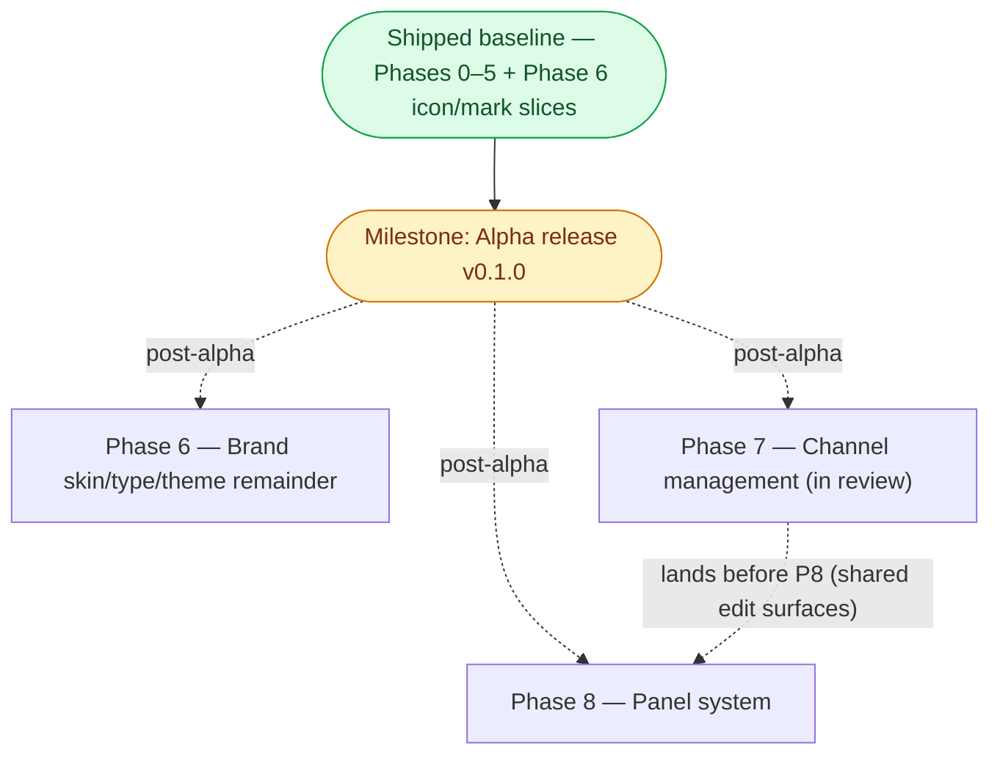

> Status: v0.1.0 release act pending (icon gate met) — Phase 6 skin remainder, Phase 7 channels (in review), Phase 8 panels remaining | Audience: contributors and agents planning next work | See also: [docs index](README.md), [Audio design](design/Audio.md), [Video design](design/Video.md), [Tracking design](design/Tracking.md), [Tech stack](development/TechStack.md), [Panel system plan](Panel-System-Plan.md), [Wyvern reskin plan](WYVERN-RESKIN-PLAN.md)

<!--
PLAN-DOC LIFECYCLE — read before editing.

This document holds forward work only.
A phase is a slice of capability with an exit criterion phrased as something observable — a command that succeeds, a panel that tracks, a stream that self-heals — never "code complete," which nobody can verify from outside the author's head.

When a phase ships, CUT it from this file.
Git history keeps the detail; this file is not the historical record, the Progress log below is (one line per completion, append-only, newest first).

ADAPTATION (decision 2026-07-18): the kit keeps exactly ONE phase in progress at a time.
This sprint runs agent-assisted parallel tracks, so the rule here is one phase in progress PER TRACK — tracks defined by the dependency graph below.
Everything not in progress stays in Backlog, unordered until picked up.
-->

# Implementation plan

**Track-parallel adaptation (decision 2026-07-18).** The seed kit assumes a solo developer and keeps exactly one phase in progress at a time.
This sprint runs agent-assisted parallel tracks once the walking skeleton lands, so that rule is adapted to **one phase in progress per track**, where tracks are defined by the dependency graph below:

- **Trunk** — Phase 0 → Phase 1, strictly sequential; both tracks branch from it.
- **Audio track** — Phase 2a → Phase 2b (the core value).
- **Video track** — Phase 3 → Phase 4.
- **Release track** — Phase 5 (pipeline plumbing, parallel to the feature tracks once Phase 0 is done).
- **Brand track** — Phase 6 (visual identity; parallel to the other tracks once the trunk landed).

The compressed calendar (Sat Jul 18 → Wed Jul 22) is only reachable because the tracks run concurrently with AI-agent assistance; every effort estimate below assumes **solo dev + AI agents**.

Two milestones are called out and are deliberately distinct: the **Monday show-open checkpoint** (a real-use gate, after Phase 2b — cleared) and the **Alpha release v0.1.0** (the tagged artifact).
Every feature phase the alpha needs has shipped — see the Progress log; what remains is the release act itself (see the Milestone section).
Three post-alpha phases follow the tag: Phase 6's skin/type/theme remainder, Phase 7 (channel management, already implemented and in review), and Phase 8 (the panel system).

## Phase dependency graph

Phases 0 through 5, and Phase 6's packaging-icon / favicon / in-app-mark slices, have shipped (see the Progress log for dates and PR numbers) and collapse into the baseline node below — this file tracks forward work only, so their individual scope and risk detail live in git history, not here.
The icon slice was the only thing gating the tag, so the alpha is reachable now (the tag is the release act, not blocked on feature work).

## Phase 6 — Brand application (skin/type/theme remainder)

**Goal.** Dress the running renderer in the Wyvern Watch visual language.
The packaging icons, renderer favicon, and in-app mark have shipped (see the Progress log); what remains is the token/typography/theme slice — the app still wears the provisional dark-only blue skin while the full dual-theme brand system sits unused under `design/brand/`.

**Detailed plan:** [WYVERN-RESKIN-PLAN.md](WYVERN-RESKIN-PLAN.md) (4-commit branch `feature/wyvern-skin`).

**Scope.**

- Token adoption: import `design/brand/tokens.css` canonically and re-point `main.css` at the semantic `--color-*` variables via a compatibility alias layer; add the missing aviation status tokens (`--color-reconnect`, `--color-cat-*`).
  Ember is the shipped dark look; Cream Classic comes along via the adaptive tokens.
- Typography: bundle Barlow Semi Condensed + Inter as committed woff2 (offline-safe, no CDN) and adopt the display / body / mono-with-tabular-figures stacks.
- In-app theme toggle: a persisted System / Cream / Ember control driven by `nativeTheme.themeSource` in the main process, so pop-outs and OS chrome follow with zero per-window sync.
- Docs-site identity (residual): the social/OG images and site favicon wired into the MkDocs config (the site already points at wyvernwatch.org).

**Depends on.** The shipped baseline.
**Should land after Phase 7 merges** — the reskin's light-theme CSS audit must cover channel-manager's appended styles (and its lone `#263141` hex), and the theme-toggle touches the same ipc/preload/session surfaces channel-manager edits.

**Exit criterion.** Renderer chrome colors come from `tokens.css` variables rather than hard-coded hexes;
flipping the OS theme swaps Ember/Cream automatically **and** the in-app toggle cycles System/Cream/Ember, persists across restart, with pop-outs following instantly;
activity lights stay clearly visible lit vs. unlit in both themes, including while muted.

**Estimated effort.** ~1 day. Solo dev + AI agents.

**Dominant risk.** Token migration touches the whole renderer stylesheet (medium likelihood, low impact);
mitigated by the compatibility alias layer (one re-point, not 1400 line edits) and a category-by-category audit against `design/brand/brand-preview.html`.

## Phase 7 — Channel management

**Goal.** Add, remove, and reorder ATC audio channels from inside the app — sourced from the LiveATC directory, persisted to `config.json`, applied live with no restart.
Retires the old hand-edit-config-and-restart workflow.

**Scope.**

- LiveATC directory search (pure HTML parse + browser-UA fetch, per-ICAO cached, only on operator gesture) with a bundled KOSH fallback when a live search fails.
- Add-channel modal (search, status/frequency display, already-added disabled), a "+" affordance in the audio panel header.
- Per-strip reorder via pointer drag and keyboard, committing renumbered priorities.
- Live engine add/remove/reorder that keeps surviving streams' volume/mute/pan.
- Atomic `config.json` write preserving all other config blocks; on remove, the resolve cache and the removed stream's session overrides are cleared.

**Depends on.** The shipped baseline. Independent of Phases 6 and 8, but merges to develop **first** so its `overlay: OverlayKind | null` store rename and new ipc/preload channels are in place before Phase 8 builds on the same surfaces.

**Exit criterion.** From a running app: add a KOSH feed from the directory and it starts streaming; remove one and its strip disappears; drag to reorder and the priority order persists; all of it survives relaunch.

**Estimated effort.** ~0.5 day (largely done).

**Status.** Implemented on `feature/channel-manager` (`07dc613`), ahead of develop — pending `just` verification pass + PR to develop.

## Phase 8 — Panel system

**Goal.** VSCode-style modular panels — first-class panels for audio, weather, FR24, and each video feed; free rearrangement; custom snap layouts and named profiles; per-video fit/fill — with the load-bearing guarantee that rearranging never reloads a video stream.

**Detailed plan:** [Panel-System-Plan.md](Panel-System-Plan.md) (6-PR stack, branches `feature/panel-*`).

**Scope.**

- A pure serializable split-tree in `session.panelLayout`, rendered by a single-container canvas (id-sorted, stable-keyed leaves — the no-reload invariant), replacing the hard-coded three-pillar `LayoutShell` and `react-resizable-panels`.
- Custom splitter (pointer + keyboard), maximize, per-feed fit/fill toggle.
- Close/reopen panels, a deterministic Move-panel modal, and drag-to-dock.
- Snaps = a template gallery **and** named saved layouts (subsumes the former "Named layout profiles" backlog item); switching must not reload streams.
- Native Layout/Panels menus (the FR24-safe surface) and the consolidated FR24 visibility rule (expressed against `overlay`, with a two-rAF reshow).

**Depends on.** The shipped baseline; **lands after Phase 7 merges** (shared `overlay` field, `LayoutShell.tsx`, `AudioPanel.tsx`, and `main.css` edit surfaces).

**Exit criterion.** The default layout matches today's arrangement; weather is its own panel; a 2×2 snap can be created and named profiles switched via a menu hotkey **without video tiles remounting**; dragging a panel onto FR24's edge hides FR24 during the drag and returns it at the correct bounds.

**Estimated effort.** ~3–4 days across 6 PRs. Solo dev + AI agents.

**Status.** Implemented across all 6 PRs — `feature/panel-layout-core` (#33), `feature/panel-canvas-shell` (#34), `feature/panel-video-polish` (#35, the maximize/fit-toggle slice), `feature/panel-menu-move` (#37), `feature/layout-snaps` (#38), and `feature/panel-drag-dock` (#39, header drag-to-dock, `react-resizable-panels` fully removed) — the first five merged to `develop`; #39 is open for review.

**Dominant risk.** A later change violating the id-sorted DOM-order invariant reloads every stream (medium likelihood, high impact);
mitigated by a loud render-site comment, a render-order guardian test, and the `isConnected` e2e proxy.

## Milestone — Alpha release (v0.1.0)

**Every feature the alpha gates on has shipped; what remains is the release act itself.**
Observable: tag `v0.1.0` publishes unsigned macOS / Windows / Linux installers to a GitHub Release.
v0.1.0 is a personal-use milestone — the primary operator's cockpit for AirVenture 2026 — and the first live validation of the release pipeline, NOT a launch:
the project is not promoted or distributed beyond personal use until LiveATC.net grants clearance for the app's use of their streams, a hard gate on any announcement (decision 2026-07-19).
Phase 6's packaging-icon slice — the only thing gating the tag — has merged to `main`, and `CHANGELOG.md` already carries a `[0.1.0]` section, so the tag is unblocked.
Channel management (Phase 7), the brand skin (Phase 6 remainder), and the panel system (Phase 8) all follow the tag.
Distinct from the Monday checkpoint — that was a real-use gate, already cleared.

## Verification

The v0.1.0 release is complete when:

- [x] CHANGELOG.md carries a `[0.1.0]` section (the release workflow gates on it).
- [x] The Phase 6 packaging-icon slice is merged, so installers carry the Wyvern Watch icon (`2cfda6d`/PR #25).
- [ ] `develop` is promoted to `main` by merge (never squash), and the Pages source is flipped to GitHub Actions right after (see [development/Pages-deployment-runbook.md](development/Pages-deployment-runbook.md)).
- [ ] The repo owner pushes the `v0.1.0` tag and the release workflow publishes installers for all three OSes.

## Backlog

<!-- Unordered, not-yet-scheduled. Move an item into its own phase section when
     picked up; delete it from here in the same commit. -->

- Contact LiveATC.net for stream-use clearance — the hard gate before any public promotion of the project.
- Live-stream auto-discovery polling.
- Recording to disk.
- Transcription / keyword alerts (local speech models on ducked buffers).
- Signing + notarization.
- Full governance (required reviews, protection on `develop`).
- Config hot-reload.
- YouTube loopback-audio capture exploration.
- Multiple simultaneous tracking panels.

## Progress log

<!-- Append-only, reverse-chronological (newest at top). One terse line per
     completion — no adjectives, no narrative. -->

- **2026-07-20** — Phase 8 (panel system) shipped end to end across 6 PRs: serializable split-tree canvas replacing the hard-coded three-pillar layout and `react-resizable-panels` (#33, #34), maximize + per-feed fit/fill (#35), close/reopen + Move-panel modal + native Layout/Panels menus (#37), snap templates + named layout profiles (#38), and header drag-to-dock (#39, `feature/panel-drag-dock`) — #39 also removes the now-unused `react-resizable-panels` dependency outright.

- **2026-07-19** — Phase 6 icon/mark slice shipped: Wyvern Watch packaged (`.icns` + PNG masters) and runtime window icons, renderer favicon set, in-app mark in header + About (PR #25).
- **2026-07-19** — On-demand ATC connections shipped: status-pill connect/disconnect, calm feed-down back-off, persisted connected set (PR #23).
- **2026-07-19** — Field-weather card shipped: METAR/TAF from aviationweather.gov with derived flight categories (PR #19).
- **2026-07-19** — Phase 5 shipped: tag-gated 3-OS release pipeline, full CI gate, GitVersion prerelease flow, MkDocs docs site (PR #20).
- **2026-07-19** — Phase 4 shipped: pop-out video windows, full session restore, missing-display bounds validator (PR #21).
- **2026-07-19** — Phase 2b shipped: priority auto-ducking, one-click solo, per-stream output-device routing, loopback renderer server for the packaged app (PR #15).
- **2026-07-19** — Phase 2a shipped: ATC audio core — 8 curated KOSH streams, per-stream volume/mute/pan, VAD-driven activity lights, automatic reconnection (PR #13).
- **2026-07-19** — Phase 3 shipped: YouTube live video grid, uniform and emphasized layouts, per-feed mute/volume, fill-panel mode (PR #11).
- **2026-07-18** — Phase 1 shipped: three-panel walking skeleton, resizable layout, embedded FR24 browser panel with bounds-synced `WebContentsView` (PR #10).
- **2026-07-18** — Phase 0 shipped: electron-vite + TypeScript + React scaffold, `app://` scheme, justfile verbs, pre-commit + CI + GitVersion kit adoption (PR #2).
- **2026-07-18** — Design docs authored (Audio, Video, Tracking, Personas ×3 + index, TechStack, this plan); no code yet.
- **2026-07-18** — Plan approved with user: stack, platforms, distribution, audio behaviors, config/persistence, build order, governance (12 decisions).
