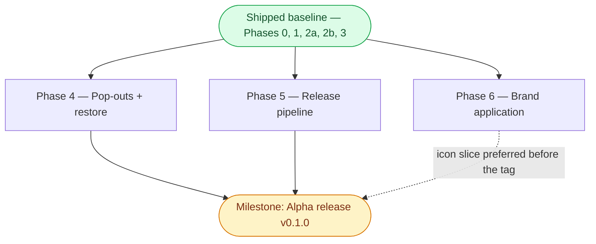

> Status: Phases 4, 5, and 6 remaining — Monday-checkpoint scope shipped 2026-07-19 | Audience: contributors and agents planning next work | See also: [docs index](README.md), [Audio design](design/Audio.md), [Video design](design/Video.md), [Tracking design](design/Tracking.md), [Tech stack](development/TechStack.md)

<!--
PLAN-DOC LIFECYCLE — read before editing.

This document holds forward work only.
A phase is a slice of capability with an exit criterion phrased as something observable — a command that succeeds, a panel that tracks, a stream that self-heals — never "code complete," which nobody can verify from outside the author's head.

When a phase ships, CUT it from this file.
Git history keeps the detail; this file is not the historical record, the Progress log below is (one line per completion, append-only, newest first).

ADAPTATION (decision 2026-07-18): the kit keeps exactly ONE phase in progress at a time.
This sprint runs agent-assisted parallel tracks, so the rule here is one phase in progress PER TRACK — tracks defined by the dependency graph below.
Everything not in progress stays in Backlog, unordered until picked up.
-->

# Implementation plan

**Track-parallel adaptation (decision 2026-07-18).** The seed kit assumes a solo developer and keeps exactly one phase in progress at a time.
This sprint runs agent-assisted parallel tracks once the walking skeleton lands, so that rule is adapted to **one phase in progress per track**, where tracks are defined by the dependency graph below:

- **Trunk** — Phase 0 → Phase 1, strictly sequential; both tracks branch from it.
- **Audio track** — Phase 2a → Phase 2b (the core value).
- **Video track** — Phase 3 → Phase 4.
- **Release track** — Phase 5 (pipeline plumbing, parallel to the feature tracks once Phase 0 is done).
- **Brand track** — Phase 6 (visual identity; parallel to the other tracks once the trunk landed).

The compressed calendar (Sat Jul 18 → Wed Jul 22) is only reachable because the tracks run concurrently with AI-agent assistance; every effort estimate below assumes **solo dev + AI agents**.

Two milestones are called out and are deliberately distinct: the **Monday show-open checkpoint** (a real-use gate, after Phase 2b) and the **Alpha release v0.1.0** (a published artifact, after Phase 5 with every exit criterion checked).
The Trunk, Audio, and Video-grid legs of that work are done — see the Progress log — which is what cleared the Monday checkpoint's hard requirement ahead of the calendar date.
What remains is the rest of the Video track (Phase 4) and the Release track (Phase 5), both needed for the Alpha milestone.

## Phase dependency graph

Phases 0, 1, 2a, 2b, and 3 have shipped (see the Progress log for dates and PR numbers) and collapse into one baseline node below — this file tracks forward work only, so their individual scope and risk detail live in git history, not here.
The two open phases both depend on that baseline and converge on the Alpha milestone, the rounded node.

## Phase 4 — Pop-outs + session restore

**Goal.** Let video grids move to additional monitors and make the entire arranged setup survive a restart — including when a monitor is gone.

**Scope.**
- popout `BrowserWindow`s (`windows:openPopout({feedIds, layout})` → same bundle at `?window=popout&id=N`; grid-only render; own session slice: bounds, displayId, feeds, layout, volumes).
- full session restore (`session.json` via electron-store, atomic writes, `session:patch` debounced ~500 ms): window bounds/display, panel layout, per-stream volume/mute/pan/priority/device, video layout, popouts, FR24 login + last URL.
- missing-display bounds validation (pure validator, vitest target): validate saved bounds vs `screen.getAllDisplays()`; recentre / reassign to primary if off-screen.

**Depends on.** Phase 2b and Phase 3 — both shipped (PRs #15 and #11).
Restore covers the per-stream audio settings 2b introduced; pop-outs carry the video grids 3 introduced.

**Exit criterion.** Relaunch reproduces the entire setup including a popout on monitor 2; with monitor 2 unplugged → popout reappears on primary.

**Estimated effort.** ~0.5 day (target: Tue eve).
Solo dev + AI agents.

**Cut-line notes.** Pop-outs are the **third cut-line** under compression; single-window session restore and the bounds validator remain.

**Dominant risk.** Multi-monitor restore with a display missing (high likelihood, low impact); mitigated by validating saved bounds against current displays and unit-testing the pure validator.
See [development/TechStack.md](development/TechStack.md).

## Phase 5 — Release pipeline

**Goal.** Turn a version tag into downloadable **unsigned** installers for macOS, Windows, and Linux on a public GitHub Release.

**Scope.**
- `release.yml` on `v*` tags → changelog-section gate → electron-builder 3-OS matrix → GitHub Release (`contents: write`), unsigned (`CSC_IDENTITY_AUTO_DISCOVERY=false`).
- full CI gate into `main` adds Playwright-Electron e2e (`xvfb-run` on Linux) + `npm audit` / osv-scanner.
- e2e launch smoke: launches, three panels render, stream strips populate from config against a looped local test-tone fixture (CI needs no LiveATC).
- GitVersion prerelease flow (`develop` → `-alpha.N`).
- docs site (decision 2026-07-18): MkDocs Material generates the public site from `docs/` — machinery in `website/` (`mkdocs.yml`, uv-managed Python deps), content stays in `docs/`; `docs/index.md` home page replaces the hand-written `docs/index.html`; Mermaid renders natively; link-hygiene pass for links escaping `docs/` (strict build).
- Pages source flipped from the legacy `main:/docs` branch build to the GitHub Actions workflow (LFS-aware checkout → build → upload-pages-artifact → deploy-pages); justfile gains `site` / `site-preview` verbs. This also un-breaks the images the legacy build serves as LFS pointer files.

**Depends on.** Phase 0 — shipped (PR #2); the CI/GitVersion substrate it needs already exists.
The full e2e gate benefits from having a real app to launch, which Phase 1 (also shipped, PR #10) now provides — the pipeline plumbing itself was never blocked on it.

**Exit criterion.** Pushing `v0.1.0` yields downloadable installers for all 3 OSes on a public GitHub Release; pushing to the default branch republishes the docs site generated from `docs/` (dependency graph rendering as a diagram, not a code block).

**Estimated effort.** ~0.75 day (target: Wed eve).
Solo dev + AI agents.

**Cut-line notes.** Phase 5 is the **last cut-line**: if compressed, run `just dev` all week and package post-show.
Within the phase, the docs site cuts to post-show without affecting installers (interim: legacy Jekyll keeps serving `main:/docs`).

**Dominant risk.** Headless e2e on Linux CI; mitigated by `xvfb-run` and keeping e2e at launch-smoke scope during the sprint.
See [development/TechStack.md](development/TechStack.md).

## Phase 6 — Brand application

**Goal.** Apply the Wyvern Watch visual language everywhere the app shows identity:
OS-level icons (dock, taskbar, launcher, installer), in-app theming from the semantic tokens, and the mark in the header and About dialog.
Every asset already exists under [design/brand/](../design/brand/) — this phase wires them in; it draws nothing new.

**Scope.**

- Packaging icons: wire electron-builder to the shipped masters
  (`design/brand/png/app-icon-ember-1024.png` for macOS/Linux, `design/brand/ico/favicon.ico` for Windows) per the packaging note in the design language doc,
  generating a true multi-resolution `.icns` from the 1024 master.
  Icon binaries stay on their existing LFS routes.
- Renderer favicon and window identity from the shipped favicon set (`src/renderer/index.html`).
- Token adoption: import `tokens.css` and migrate renderer stylesheets from hard-coded hexes to the semantic `--color-*` variables;
  Ember is the shipped dark look, and Cream Classic comes along free via the adaptive tokens.
- Typography: adopt the three stacks from the design language (display, body, mono with tabular figures for callsigns/frequencies) with system-sans fallbacks;
  whether to bundle the font files is a decision inside the phase.
- The mark in-app: the adaptive `icon.svg` beside the header title and in the About modal
  (`icon-mono.svg` where a single tint is needed).
- Docs-site identity: favicon and the social/OG images wired into the site config once Phase 5's site machinery lands.

**Depends on.** The shipped baseline; nothing in Phases 4 or 5 blocks it.
The docs-site identity item touches Phase 5's `website/` machinery, so that one item lands after Phase 5 merges.

**Exit criterion.** A packaged build shows the Wyvern Watch icon in the macOS dock, Windows taskbar, and Linux launcher;
the header and About dialog show the mark;
renderer chrome colors come from `tokens.css` variables rather than hard-coded hexes, and flipping the OS theme swaps Ember/Cream automatically.

**Estimated effort.** ~0.5 day.
Solo dev + AI agents.

**Cut-line notes.** Scheduled after the smaller post-alpha fixes;
the packaging-icon slice is small and is preferred before the `v0.1.0` tag so the alpha installers carry the mark instead of the stock Electron icon.

**Dominant risk.** Token migration touches every renderer stylesheet (medium likelihood, low impact);
mitigated by migrating panel-by-panel against `brand-preview.html` as the visual reference.

## Milestone — Alpha release (v0.1.0)

**After Phases 4 and 5, once their exit criteria above are checked.**
Phase 6 does not gate the milestone, except that its packaging-icon slice is preferred before the tag (see its cut-line notes).
Observable: tag `v0.1.0` publishes unsigned macOS / Windows / Linux installers to a public GitHub Release.
Depends on Phase 4 (feature-complete alpha) and Phase 5 (the pipeline).
Distinct from the Monday checkpoint — that was a real-use gate, already cleared; this is the published artifact.

## Verification

Phase 4 (the next work) is complete when:

- [ ] A subset of video feeds can be popped out into its own window (`windows:openPopout`), and it keeps playing while the main grid keeps running.
- [ ] Relaunching the app restores the entire session unattended: window bounds and display, panel layout, every stream's volume/mute/pan/priority/device routing, the video layout, and every popout — including FR24's login and last map view.
- [ ] With a popout's display disconnected at launch, the popout still opens, recentred onto the primary display — never off-screen and invisible.
- [ ] The missing-display bounds validator is a pure, vitest-covered function (saved bounds vs `screen.getAllDisplays()`, recentre / reassign to primary on a mismatch).

## Backlog

<!-- Unordered, not-yet-scheduled. Move an item into its own phase section when
     picked up; delete it from here in the same commit. -->

- Stream add/remove management UI.
- Named layout profiles.
- Live-stream auto-discovery polling.
- Recording to disk.
- Transcription / keyword alerts (local speech models on ducked buffers).
- Signing + notarization.
- Full governance (required reviews, protection on `develop`).
- Config hot-reload.
- YouTube loopback-audio capture exploration.
- Multiple simultaneous tracking panels.

## Progress log

<!-- Append-only, reverse-chronological (newest at top). One terse line per
     completion — no adjectives, no narrative. -->

- **2026-07-19** — Phase 2b shipped: priority auto-ducking, one-click solo, per-stream output-device routing, loopback renderer server for the packaged app (PR #15).
- **2026-07-19** — Phase 2a shipped: ATC audio core — 8 curated KOSH streams, per-stream volume/mute/pan, VAD-driven activity lights, automatic reconnection (PR #13).
- **2026-07-19** — Phase 3 shipped: YouTube live video grid, uniform and emphasized layouts, per-feed mute/volume, fill-panel mode (PR #11).
- **2026-07-18** — Phase 1 shipped: three-panel walking skeleton, resizable layout, embedded FR24 browser panel with bounds-synced `WebContentsView` (PR #10).
- **2026-07-18** — Phase 0 shipped: electron-vite + TypeScript + React scaffold, `app://` scheme, justfile verbs, pre-commit + CI + GitVersion kit adoption (PR #2).
- **2026-07-18** — Design docs authored (Audio, Video, Tracking, Personas ×3 + index, TechStack, this plan); no code yet.
- **2026-07-18** — Plan approved with user: stack, platforms, distribution, audio behaviors, config/persistence, build order, governance (12 decisions).
