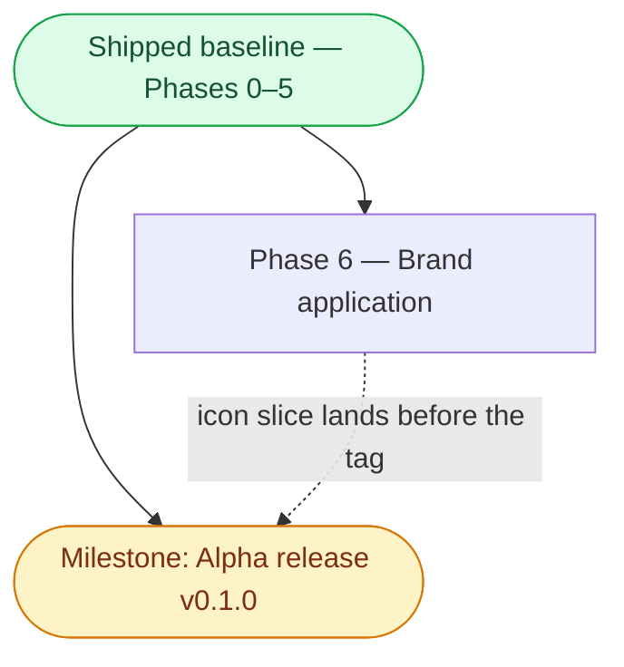

> Status: Phase 6 and the v0.1.0 tag remaining — Phases 4 and 5 shipped 2026-07-19 | Audience: contributors and agents planning next work | See also: [docs index](README.md), [Audio design](design/Audio.md), [Video design](design/Video.md), [Tracking design](design/Tracking.md), [Tech stack](development/TechStack.md)

<!--
PLAN-DOC LIFECYCLE — read before editing.

This document holds forward work only.
A phase is a slice of capability with an exit criterion phrased as something observable — a command that succeeds, a panel that tracks, a stream that self-heals — never "code complete," which nobody can verify from outside the author's head.

When a phase ships, CUT it from this file.
Git history keeps the detail; this file is not the historical record, the Progress log below is (one line per completion, append-only, newest first).

ADAPTATION (decision 2026-07-18): the kit keeps exactly ONE phase in progress at a time.
This sprint runs agent-assisted parallel tracks, so the rule here is one phase in progress PER TRACK — tracks defined by the dependency graph below.
Everything not in progress stays in Backlog, unordered until picked up.
-->

# Implementation plan

**Track-parallel adaptation (decision 2026-07-18).** The seed kit assumes a solo developer and keeps exactly one phase in progress at a time.
This sprint runs agent-assisted parallel tracks once the walking skeleton lands, so that rule is adapted to **one phase in progress per track**, where tracks are defined by the dependency graph below:

- **Trunk** — Phase 0 → Phase 1, strictly sequential; both tracks branch from it.
- **Audio track** — Phase 2a → Phase 2b (the core value).
- **Video track** — Phase 3 → Phase 4.
- **Release track** — Phase 5 (pipeline plumbing, parallel to the feature tracks once Phase 0 is done).
- **Brand track** — Phase 6 (visual identity; parallel to the other tracks once the trunk landed).

The compressed calendar (Sat Jul 18 → Wed Jul 22) is only reachable because the tracks run concurrently with AI-agent assistance; every effort estimate below assumes **solo dev + AI agents**.

Two milestones are called out and are deliberately distinct: the **Monday show-open checkpoint** (a real-use gate, after Phase 2b — cleared) and the **Alpha release v0.1.0** (the tagged artifact).
Every feature phase the alpha needs has shipped — see the Progress log; what remains is the release act itself (see the Milestone section) and Phase 6, which follows it.

## Phase dependency graph

Phases 0 through 5 have shipped (see the Progress log for dates and PR numbers) and collapse into one baseline node below — this file tracks forward work only, so their individual scope and risk detail live in git history, not here.

## Phase 6 — Brand application

**Goal.** Apply the Wyvern Watch visual language everywhere the app shows identity:
OS-level icons (dock, taskbar, launcher, installer), in-app theming from the semantic tokens, and the mark in the header and About dialog.
Every asset already exists under [design/brand/](../design/brand/) — this phase wires them in; it draws nothing new.

**Scope.**

- Packaging icons: wire electron-builder to the shipped masters
  (`design/brand/png/app-icon-ember-1024.png` for macOS/Linux, `design/brand/ico/favicon.ico` for Windows) per the packaging note in the design language doc,
  generating a true multi-resolution `.icns` from the 1024 master.
  Icon binaries stay on their existing LFS routes.
- Renderer favicon and window identity from the shipped favicon set (`src/renderer/index.html`).
- Token adoption: import `tokens.css` and migrate renderer stylesheets from hard-coded hexes to the semantic `--color-*` variables;
  Ember is the shipped dark look, and Cream Classic comes along free via the adaptive tokens.
- Typography: adopt the three stacks from the design language (display, body, mono with tabular figures for callsigns/frequencies) with system-sans fallbacks;
  whether to bundle the font files is a decision inside the phase.
- The mark in-app: the adaptive `icon.svg` beside the header title and in the About modal
  (`icon-mono.svg` where a single tint is needed).
- Docs-site identity: favicon and the social/OG images wired into the site config once Phase 5's site machinery lands.

**Depends on.** The shipped baseline; nothing in Phases 4 or 5 blocks it.
The docs-site identity item touches Phase 5's `website/` machinery, so that one item lands after Phase 5 merges.

**Exit criterion.** A packaged build shows the Wyvern Watch icon in the macOS dock, Windows taskbar, and Linux launcher;
the header and About dialog show the mark;
renderer chrome colors come from `tokens.css` variables rather than hard-coded hexes, and flipping the OS theme swaps Ember/Cream automatically.

**Estimated effort.** ~0.5 day.
Solo dev + AI agents.

**Cut-line notes.** Scheduled after the smaller post-alpha fixes;
the packaging-icon slice is small and is preferred before the `v0.1.0` tag so the alpha installers carry the mark instead of the stock Electron icon.

**Dominant risk.** Token migration touches every renderer stylesheet (medium likelihood, low impact);
mitigated by migrating panel-by-panel against `brand-preview.html` as the visual reference.

## Milestone — Alpha release (v0.1.0)

**Phases 4 and 5 have shipped; what remains is the release act itself.**
Observable: tag `v0.1.0` publishes unsigned macOS / Windows / Linux installers to a GitHub Release.
v0.1.0 is a personal-use milestone — the primary operator's cockpit for AirVenture 2026 — and the first live validation of the release pipeline, NOT a launch:
the project is not promoted or distributed beyond personal use until LiveATC.net grants clearance for the app's use of their streams, a hard gate on any announcement (decision 2026-07-19).
Phase 6's packaging-icon slice lands before the tag (see its cut-line notes); the rest of Phase 6 follows the release.
Distinct from the Monday checkpoint — that was a real-use gate, already cleared.

## Verification

The v0.1.0 release is complete when:

- [ ] CHANGELOG.md carries a `[0.1.0]` section (the release workflow gates on it).
- [ ] The Phase 6 packaging-icon slice is merged, so installers carry the Wyvern Watch icon.
- [ ] `develop` is promoted to `main` by merge (never squash), and the Pages source is flipped to GitHub Actions right after (see [development/Pages-deployment-runbook.md](development/Pages-deployment-runbook.md)).
- [ ] The repo owner pushes the `v0.1.0` tag and the release workflow publishes installers for all three OSes.

## Backlog

<!-- Unordered, not-yet-scheduled. Move an item into its own phase section when
     picked up; delete it from here in the same commit. -->

- Contact LiveATC.net for stream-use clearance — the hard gate before any public promotion of the project.
- Stream add/remove management UI.
- Named layout profiles.
- Live-stream auto-discovery polling.
- Recording to disk.
- Transcription / keyword alerts (local speech models on ducked buffers).
- Signing + notarization.
- Full governance (required reviews, protection on `develop`).
- Config hot-reload.
- YouTube loopback-audio capture exploration.
- Multiple simultaneous tracking panels.

## Progress log

<!-- Append-only, reverse-chronological (newest at top). One terse line per
     completion — no adjectives, no narrative. -->

- **2026-07-19** — On-demand ATC connections shipped: status-pill connect/disconnect, calm feed-down back-off, persisted connected set (PR #23).
- **2026-07-19** — Field-weather card shipped: METAR/TAF from aviationweather.gov with derived flight categories (PR #19).
- **2026-07-19** — Phase 5 shipped: tag-gated 3-OS release pipeline, full CI gate, GitVersion prerelease flow, MkDocs docs site (PR #20).
- **2026-07-19** — Phase 4 shipped: pop-out video windows, full session restore, missing-display bounds validator (PR #21).
- **2026-07-19** — Phase 2b shipped: priority auto-ducking, one-click solo, per-stream output-device routing, loopback renderer server for the packaged app (PR #15).
- **2026-07-19** — Phase 2a shipped: ATC audio core — 8 curated KOSH streams, per-stream volume/mute/pan, VAD-driven activity lights, automatic reconnection (PR #13).
- **2026-07-19** — Phase 3 shipped: YouTube live video grid, uniform and emphasized layouts, per-feed mute/volume, fill-panel mode (PR #11).
- **2026-07-18** — Phase 1 shipped: three-panel walking skeleton, resizable layout, embedded FR24 browser panel with bounds-synced `WebContentsView` (PR #10).
- **2026-07-18** — Phase 0 shipped: electron-vite + TypeScript + React scaffold, `app://` scheme, justfile verbs, pre-commit + CI + GitVersion kit adoption (PR #2).
- **2026-07-18** — Design docs authored (Audio, Video, Tracking, Personas ×3 + index, TechStack, this plan); no code yet.
- **2026-07-18** — Plan approved with user: stack, platforms, distribution, audio behaviors, config/persistence, build order, governance (12 decisions).
