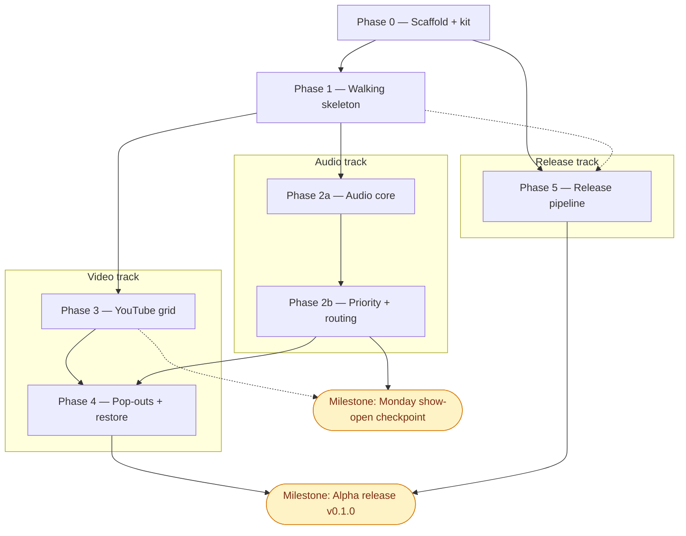

> Status: Phase 0 not started — docs under review, build awaiting green-light | Audience: contributors and agents planning next work | See also: [docs index](README.md), [Audio design](design/Audio.md), [Video design](design/Video.md), [Tracking design](design/Tracking.md), [Tech stack](development/TechStack.md)

<!--
PLAN-DOC LIFECYCLE — read before editing.

This document holds forward work only.
A phase is a slice of capability with an exit criterion phrased as something observable — a command that succeeds, a panel that tracks, a stream that self-heals — never "code complete," which nobody can verify from outside the author's head.

When a phase ships, CUT it from this file.
Git history keeps the detail; this file is not the historical record, the Progress log below is (one line per completion, append-only, newest first).

ADAPTATION (decision 2026-07-18): the kit keeps exactly ONE phase in progress at a time.
This sprint runs agent-assisted parallel tracks, so the rule here is one phase in progress PER TRACK — tracks defined by the dependency graph below.
Everything not in progress stays in Backlog, unordered until picked up.
-->

# Implementation plan

**Track-parallel adaptation (decision 2026-07-18).** The seed kit assumes a solo developer and keeps exactly one phase in progress at a time.
This sprint runs agent-assisted parallel tracks once the walking skeleton lands, so that rule is adapted to **one phase in progress per track**, where tracks are defined by the dependency graph below:

- **Trunk** — Phase 0 → Phase 1, strictly sequential; both tracks branch from it.
- **Audio track** — Phase 2a → Phase 2b (the core value).
- **Video track** — Phase 3 → Phase 4.
- **Release track** — Phase 5 (pipeline plumbing, parallel to the feature tracks once Phase 0 is done).

The compressed calendar (Sat Jul 18 → Wed Jul 22) is only reachable because the tracks run concurrently with AI-agent assistance; every effort estimate below assumes **solo dev + AI agents**.

Two milestones are called out and are deliberately distinct: the **Monday show-open checkpoint** (a real-use gate, after Phase 2b) and the **Alpha release v0.1.0** (a published artifact, after Phase 5 with every exit criterion checked).

## Phase dependency graph

Nodes are phases and milestones; edges are hard dependencies only.
Solid = hard blocker; dashed = benefits-from / optional-for.
Milestones are the rounded nodes.

Reading the graph: after Phase 1 fans out, the audio track (2a→2b) and video track (3) run in parallel, and the release track (5) can proceed as soon as Phase 0's CI/GitVersion substrate exists.
The Monday checkpoint hard-requires 2b; Phase 3 feeds sweeten it but are not strictly required (dashed).
The full e2e gate in Phase 5 benefits from Phase 1 having something to launch (dashed), but the pipeline plumbing does not block on it.

## Phase 0 — Scaffold + kit adoption

**Goal.** Stand up the electron-vite / TypeScript / React substrate and adopt the seed kit so every later phase inherits task verbs, CI, secret scanning, versioning, and a docs home before the first feature makes them expensive to retrofit.

**Scope.**
- electron-vite React-TS project boots (main + preload + renderer; three tsconfigs).
- `app://` privileged custom scheme registered (`protocol.handle` + `net.fetch(pathToFileURL(...))`, `standard: true, secure: true`) — prerequisite for the YouTube IFrame postMessage handshake and for prod `enumerateDevices` / `setSinkId` in a secure context.
- justfile verbs mapped to npm/electron-vite: `dev`, `test`, `e2e`, `lint`, `fmt`, `typecheck`, `version`, `up`, `reset` (typed-confirmation destructive clean); `down`/`migrate`/`health` echo "n/a desktop app".
- pre-commit hook: gitleaks + eslint + prettier.
- CI fast tier on every PR: actionlint + eslint + tsc + vitest.
- GitVersion (GitHubFlow); `develop` set as default branch; protect `main` only (status checks, no required reviews); squash/rebase merges disabled (merge-commits only — GitVersion dependency).
- Tier-1 verbatim kit copies: `.gitignore` entries, `CHANGELOG.md` (Keep-a-Changelog), `cache-cleanup.yml`, dependabot (github-actions + npm), PR template, docs tree (`design/`, `development/`, `decisions/`, `archive/`), `tests/{unit,integration,e2e}/`.
- `CLAUDE.md` rewritten to <150 lines (the current one says "stack undecided" — stale after this plan).
- docs: the design set (pillar docs, personas, tech stack, this plan) already landed 2026-07-18 — see Progress log. Phase 0 adds `development/Getting-Started.md` and `development/Testing.md`, and keeps [`decisions/README.md`](decisions/README.md) reconciled with the inline stamps.

**Depends on.** Nothing (trunk root).

**Exit criterion.** Clean clone: `just dev` opens a window; a PR shows green lint/typecheck/unit CI; a committed fake secret is blocked locally by the hook.

**Estimated effort.** ~0.5 day (target: Sat).
Solo dev + AI agents.

**Cut-line notes.** Not cuttable — substrate for all tracks; Phase 5 depends on the CI/GitVersion pieces landing here.

**Dominant risk.** Packaged-origin gotcha — the YouTube IFrame API postMessage handshake is unreliable from `file://`, so the `app://` scheme must land in this phase or Phase 3 and prod device routing break later.
See [development/TechStack.md](development/TechStack.md).

## Phase 1 — Walking skeleton

**Goal.** Prove the three-panel layout and the hardest layout risk — a native FR24 browser view whose bounds track a resizable DOM region gap-free — before any feature content exists.
FR24 is embedded early precisely because bounds-sync is the foundational layout risk (decision 2026-07-18).

**Scope.**
- 3-panel resizable layout (react-resizable-panels): audio left, FR24 top-right, video bottom-right.
- FR24 `WebContentsView`, `partition: 'persist:fr24'`, Chrome UA with the `Electron/x.y` token stripped (Cloudflare hygiene).
- rAF-throttled (trailing-edge) bounds sync from a placeholder div in a non-scrolling region (ResizeObserver + window resize; rounded `getBoundingClientRect()` DIPs; no debounce — debounce reads as jank).
- z-order handling: `overlayOpen` → `fr24:setVisible(false)` under overlays/modals; native Electron menus over the FR24 region.
- toolbar: back / forward / reload / home (KOSH preset URL) / read-only URL field; main pushes `fr24:navState` on `did-navigate*` and loading events.
- last-URL persistence (`did-navigate-in-page` → persist `getURL()` debounced 2 s; `loadURL(saved ?? home)` on launch) — near-free map-position restore.
- `setWindowOpenHandler`: deny popups; external links → `shell.openExternal`.

**Depends on.** Phase 0.

**Exit criterion.** Panel dividers drag with FR24 tracking gap-free; log into FR24 Gold, relaunch → still logged in at last map view.

**Estimated effort.** ~0.75 day (target: Sat–Sun AM).
Solo dev + AI agents.

**Cut-line notes.** FR24 panel is never cut; the skeleton is the foundation both feature tracks branch from.

**Dominant risk.** FR24 Cloudflare challenge in Electron plus `WebContentsView` bounds jank / z-order; mitigated by the clean stripped UA on `persist:fr24` day one and rAF-throttled `setBounds`.
See [development/TechStack.md](development/TechStack.md).

## Phase 2a — Audio core

**Goal.** Turn the six curated KOSH feeds into simultaneously audible, self-healing streams with per-stream volume / mute / pan and activity lights that match what the operator hears — including on muted streams.

**Scope.**
- 6 curated streams loaded from config; main-process `plsResolver.ts` (browser UA — LiveATC blocks bot UAs; parse `File1`; follow 302s via `net.fetch` → final https URL; re-resolve every reconnect onto a fresh rotating host).
- per-stream graph: `<audio crossorigin> → MediaElementAudioSourceNode`; AnalyserNode VAD tap **pre-gain, parallel** (post-duck tapping = measurement feedback loop); `Gain(userVolume) → Gain(duckGain) → StereoPanner → destination`.
- volume, mute (**userVolume gain → 0, never `element.muted`** — lights must work while muted), and pan per stream.
- VAD (pure `vad.ts`, vitest target; params in `config.json` `vad` block): 50 ms `setInterval` (never rAF — freezes when hidden; `backgroundThrottling: false` on main window); RMS→dBFS; adaptive noise floor; hysteresis (active at floor+8 dB, release at floor+4 dB); attack 2 ticks; 700 ms hang. Drives the activity lights.
- status chips (connecting / live / reconnecting+count / error) separate from the activity light.
- reconnect state machine: `idle→resolving→connecting→live⇄reconnecting(n)`; stall watchdog (`!paused` and `currentTime` frozen >6 s, **never** VAD silence — squelched frequencies are legitimately silent for minutes); exponential backoff 1→2→4→8→15→30 s cap, ±20% jitter, infinite retries; rebuild a fresh `<audio>`+source into the **same living context/gain chain** so settings survive reconnects.

**Depends on.** Phase 1.

**Exit criterion.** All 6 KOSH feeds audible at once; lights match ears including muted streams; Wi-Fi off/on → all streams return to `live` unattended.

**Estimated effort.** ~1 day (target: Sun).
Solo dev + AI agents.

**Cut-line notes.** Never cut — 2a is the core value that replaces the VLC army.

**Dominant risk.** LiveATC blocks bot user-agents and can rate-limit (confirmed), plus suspended-AudioContext / autoplay stalls; mitigated by browser-UA + cached resolution (resolve only on connect/reconnect) and explicit `autoplayPolicy` + a `resume()` watchdog.
See [development/TechStack.md](development/TechStack.md).

## Phase 2b — Priority + routing

**Goal.** Add the separation layer — priority ducking, one-click solo, stereo pan and per-stream device routing — so overlapping calls resolve in favor of the channel that matters.
Sequenced lights → solo → pan → duck (decision 2026-07-18).

**Scope.**
- **Open with a 15-minute `AudioContext.setSinkId` spike** in the shipped Electron build; if quirky, the pivot is confined to `streamPlayer.ts` (`MediaStreamAudioDestinationNode → hidden <audio>.setSinkId`).
- priority ranks from config (defaults: 1 EmergencyGuard, 2 Tower, 3 Fisk VFR Approach, 4 Gnd/Twr, 5 Departure Monitor, 6 Seaplane Base, 7 ATIS).
- ducking (pure `ducking.ts`: `(streams, activeSet, soloId) → Map<id, gain>`): duck iff a **strictly higher** priority stream is active (equal ranks never duck each other); target 0.25 (−12 dB); `setTargetAtTime` asymmetric ramps (duck τ=50 ms, restore τ=200 ms). Anti-pumping = VAD hang + slow restore + floor freeze.
- one-click solo (soloed → 1.0, rest → 0.0, same ramps).
- per-stream output device picker via `setSinkId`; persist `{deviceId, deviceLabel}`, match-by-label after replug; `devicechange` losing a routed device → default output + toast. Document: Bluetooth outputs lag wired by 150–300 ms.

**Depends on.** Phase 2a.

**Exit criterion.** Tower activity audibly ducks Fisk in ~200 ms, smooth release, no pumping; Tower on headphones while others play on speakers.

**Estimated effort.** ~0.5 day (target: Sun eve–Mon AM), plus the 15-min spike up front.
Solo dev + AI agents.

**Cut-line notes.** Device routing is the **first cut-line** if time compresses — pan + duck already deliver most of the separation value.
Priority / duck / solo are not cut.

**Dominant risk.** `AudioContext.setSinkId` quirks in the shipped Electron build; the opening spike de-risks it and confines any pivot to `streamPlayer.ts`.
See [development/TechStack.md](development/TechStack.md).

## Milestone — Monday show-open checkpoint

**After Phase 2b (Mon).** Observable gate: the app replaces the six-VLC + browser-tabs army for a real monitoring session at show open.
Hard-requires the Audio track (2a + 2b) as the core value, running against the FR24 panel from Phase 1; the Phase 3 video feeds sweeten it but are **not strictly required** to clear the bar (dashed edge in the graph).
Distinct from the Alpha release — this is a real-use gate, not a published artifact.

## Phase 3 — YouTube grid

**Goal.** Tile the EAA live feeds with uniform and emphasized layouts, identity overlays, per-feed audio control, and fill-panel fullscreen.

**Scope.**
- players from config via the IFrame API (`@types/youtube`; one script load per renderer; `{ autoplay: 1, mute: 1, playsinline: 1, controls: 1 }` — start muted for autoplay, native controls kept for the free live-edge + quality menu).
- layouts: `uniform` (CSS grid, `ceil(sqrt(n))` cols) + `emphasized` (`grid-template-areas`, one 2×2 + thumbnail rail); double-click toggles emphasis.
- label overlays as plain DOM over the iframes (`pointer-events: none` except controls) — this composability is why YouTube gets iframes and FR24 gets a WebContentsView.
- per-feed volume / mute via the IFrame API only. **Honest limitation:** YouTube iframe audio can't be Web-Audio-analyzed or device-routed — it gets IFrame-API volume/mute and the system-default device (document + tooltip).
- fill-video-panel "fullscreen" as a layout state; `requestFullscreen()` on double-click as secondary.
- verify hardware decode via `chrome://gpu` day 1.
- **Stretch:** `youtube:listLive` on-demand refresh (main-process scrape of `@EAA/streams` `ytInitialData`; single request; 5-min cache; no polling → no ban risk).

**Depends on.** Phase 1.
(Runs in parallel with the Audio track.)

**Exit criterion.** 5 EAA feeds tiled; double-click emphasizes; independent mutes; CPU acceptable.

**Estimated effort.** ~0.5 day (target: Mon eve).
Solo dev + AI agents.

**Cut-line notes.** Emphasized layout is the **second cut-line**; the `listLive` refresh is a stretch and cuttable.
Uniform grid is never cut.

**Dominant risk.** AV1 → software decode across 5 feeds on pre-M3 Apple Silicon; mitigated by smaller tiles pulling lower res and reducing feed count.
See [development/TechStack.md](development/TechStack.md).

## Phase 4 — Pop-outs + session restore

**Goal.** Let video grids move to additional monitors and make the entire arranged setup survive a restart — including when a monitor is gone.

**Scope.**
- popout `BrowserWindow`s (`windows:openPopout({feedIds, layout})` → same bundle at `?window=popout&id=N`; grid-only render; own session slice: bounds, displayId, feeds, layout, volumes).
- full session restore (`session.json` via electron-store, atomic writes, `session:patch` debounced ~500 ms): window bounds/display, panel layout, per-stream volume/mute/pan/priority/device, video layout, popouts, FR24 login + last URL.
- missing-display bounds validation (pure validator, vitest target): validate saved bounds vs `screen.getAllDisplays()`; recentre / reassign to primary if off-screen.

**Depends on.** Phase 2b (restore covers audio settings) and Phase 3 (pop-outs carry video grids).

**Exit criterion.** Relaunch reproduces the entire setup including a popout on monitor 2; with monitor 2 unplugged → popout reappears on primary.

**Estimated effort.** ~0.5 day (target: Tue eve).
Solo dev + AI agents.

**Cut-line notes.** Pop-outs are the **third cut-line** under compression; single-window session restore and the bounds validator remain.

**Dominant risk.** Multi-monitor restore with a display missing (high likelihood, low impact); mitigated by validating saved bounds against current displays and unit-testing the pure validator.
See [development/TechStack.md](development/TechStack.md).

## Phase 5 — Release pipeline

**Goal.** Turn a version tag into downloadable **unsigned** installers for macOS, Windows, and Linux on a public GitHub Release.

**Scope.**
- `release.yml` on `v*` tags → changelog-section gate → electron-builder 3-OS matrix → GitHub Release (`contents: write`), unsigned (`CSC_IDENTITY_AUTO_DISCOVERY=false`).
- full CI gate into `main` adds Playwright-Electron e2e (`xvfb-run` on Linux) + `npm audit` / osv-scanner.
- e2e launch smoke: launches, three panels render, stream strips populate from config against a looped local test-tone fixture (CI needs no LiveATC).
- GitVersion prerelease flow (`develop` → `-alpha.N`).
- docs site (decision 2026-07-18): MkDocs Material generates the public site from `docs/` — machinery in `website/` (`mkdocs.yml`, uv-managed Python deps), content stays in `docs/`; `docs/index.md` home page replaces the hand-written `docs/index.html`; Mermaid renders natively; link-hygiene pass for links escaping `docs/` (strict build).
- Pages source flipped from the legacy `main:/docs` branch build to the GitHub Actions workflow (LFS-aware checkout → build → upload-pages-artifact → deploy-pages); justfile gains `site` / `site-preview` verbs. This also un-breaks the images the legacy build serves as LFS pointer files.

**Depends on.** Phase 0 (CI/GitVersion substrate).
The full e2e gate benefits from Phase 1 having something to launch (dashed), but the pipeline plumbing proceeds in parallel with the Audio and Video tracks.

**Exit criterion.** Pushing `v0.1.0` yields downloadable installers for all 3 OSes on a public GitHub Release; pushing to the default branch republishes the docs site generated from `docs/` (dependency graph rendering as a diagram, not a code block).

**Estimated effort.** ~0.75 day (target: Wed eve).
Solo dev + AI agents.

**Cut-line notes.** Phase 5 is the **last cut-line**: if compressed, run `just dev` all week and package post-show.
Within the phase, the docs site cuts to post-show without affecting installers (interim: legacy Jekyll keeps serving `main:/docs`).

**Dominant risk.** Headless e2e on Linux CI; mitigated by `xvfb-run` and keeping e2e at launch-smoke scope during the sprint.
See [development/TechStack.md](development/TechStack.md).

## Milestone — Alpha release (v0.1.0)

**After Phase 5, once every phase exit criterion above is checked.** Observable: tag `v0.1.0` publishes unsigned macOS / Windows / Linux installers to a public GitHub Release.
Depends on Phase 4 (feature-complete alpha) and Phase 5 (the pipeline).
Distinct from the Monday checkpoint — that is a real-use gate; this is the published artifact.

## Verification

Phase 0 (the next work) is complete when:

- [ ] A clean clone runs `just dev` and reaches a running window with no manual step.
- [ ] A PR shows green lint / typecheck / unit CI within the fast tier.
- [ ] A committed fake secret is blocked locally by the gitleaks pre-commit hook.
- [ ] `development/Getting-Started.md` and `development/Testing.md` exist, `decisions/README.md` matches the inline stamps, and the `CLAUDE.md` rewrite (<150 lines) has landed.

## Backlog

<!-- Unordered, not-yet-scheduled. Move an item into its own phase section when
     picked up; delete it from here in the same commit. -->

- Stream add/remove management UI.
- Named layout profiles.
- Live-stream auto-discovery polling.
- Recording to disk.
- Transcription / keyword alerts (local speech models on ducked buffers).
- Signing + notarization.
- Full governance (required reviews, protection on `develop`).
- Config hot-reload.
- YouTube loopback-audio capture exploration.
- Multiple simultaneous tracking panels.

## Progress log

<!-- Append-only, reverse-chronological (newest at top). One terse line per
     completion — no adjectives, no narrative. -->

- **2026-07-18** — Design docs authored (Audio, Video, Tracking, Personas ×3 + index, TechStack, this plan); no code yet.
- **2026-07-18** — Plan approved with user: stack, platforms, distribution, audio behaviors, config/persistence, build order, governance (12 decisions).
