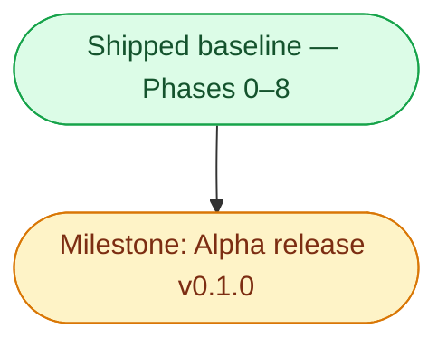

> Status: v0.1.0 release act pending — every feature phase (through Phase 8) has shipped to `develop`; only the owner release act remains | Audience: contributors and agents planning next work | See also: [docs index](README.md), [Audio design](design/Audio.md), [Video design](design/Video.md), [Tracking design](design/Tracking.md), [Layout design](design/Layout.md), [Tech stack](development/TechStack.md)

<!--
PLAN-DOC LIFECYCLE — read before editing.

This document holds forward work only.
A phase is a slice of capability with an exit criterion phrased as something observable — a command that succeeds, a panel that tracks, a stream that self-heals — never "code complete," which nobody can verify from outside the author's head.

When a phase ships, CUT it from this file.
Git history keeps the detail; this file is not the historical record, the Progress log below is (one line per completion, append-only, newest first).

ADAPTATION (decision 2026-07-18): the kit keeps exactly ONE phase in progress at a time.
This sprint runs agent-assisted parallel tracks, so the rule here is one phase in progress PER TRACK — tracks defined by the dependency graph below.
Everything not in progress stays in Backlog, unordered until picked up.
-->

# Implementation plan

**Track-parallel adaptation (decision 2026-07-18).** The seed kit assumes a solo developer and keeps exactly one phase in progress at a time.
This sprint runs agent-assisted parallel tracks once the walking skeleton lands, so that rule is adapted to **one phase in progress per track**, where tracks are defined by the dependency graph below:

- **Trunk** — Phase 0 → Phase 1, strictly sequential; both tracks branch from it.
- **Audio track** — Phase 2a → Phase 2b (the core value).
- **Video track** — Phase 3 → Phase 4.
- **Release track** — Phase 5 (pipeline plumbing, parallel to the feature tracks once Phase 0 is done).
- **Brand track** — Phase 6 (visual identity; parallel to the other tracks once the trunk landed).

The compressed calendar (Sat Jul 18 → Wed Jul 22) is only reachable because the tracks run concurrently with AI-agent assistance; every effort estimate below assumes **solo dev + AI agents**.

Two milestones are called out and are deliberately distinct: the **Monday show-open checkpoint** (a real-use gate, after Phase 2b — cleared) and the **Alpha release v0.1.0** (the tagged artifact).
Every feature phase — including the post-alpha Phases 6 (brand skin), 7 (channel management), and 8 (panel system) — has now shipped to `develop`; see the Progress log.
The only forward work left is the release act itself (see the Milestone section).

## Phase dependency graph

Phases 0 through 8 have shipped (see the Progress log for dates and PR numbers) and collapse into the single baseline node below — this file tracks forward work only, so their scope and risk detail live in git history, not here.
The only thing between here and the tagged alpha is the release act (a `develop`→`main` promotion plus the owner pushing the tag).

## Milestone — Alpha release (v0.1.0)

**Every feature the alpha gates on has shipped; what remains is the release act itself.**
Observable: tag `v0.1.0` publishes unsigned macOS / Windows / Linux installers to a GitHub Release.
v0.1.0 is a personal-use milestone — the primary operator's cockpit for AirVenture 2026 — and the first live validation of the release pipeline, NOT a launch:
the project is not promoted or distributed beyond personal use until LiveATC.net grants clearance for the app's use of their streams, a hard gate on any announcement (decision 2026-07-19).
Phase 6's packaging-icon slice — the only thing that ever gated the tag — is already on `main`, and `CHANGELOG.md` carries a `[0.1.0]` section, so the tag is unblocked.
The post-alpha feature work (channel management, the brand skin, the panel system) has since shipped to `develop`, so the `develop`→`main` promotion carries all of it into the alpha.
Distinct from the Monday checkpoint — that was a real-use gate, already cleared.

## Verification

The v0.1.0 release is complete when:

- [x] CHANGELOG.md carries a `[0.1.0]` section (the release workflow gates on it).
- [x] The Phase 6 packaging-icon slice is merged, so installers carry the Wyvern Watch icon (`2cfda6d`/PR #25).
- [ ] `develop` is promoted to `main` by merge (never squash), and the Pages source is flipped to GitHub Actions right after (see [development/Pages-deployment-runbook.md](development/Pages-deployment-runbook.md)).
- [ ] The repo owner pushes the `v0.1.0` tag and the release workflow publishes installers for all three OSes.

## Backlog

<!-- Unordered, not-yet-scheduled. Move an item into its own phase section when
     picked up; delete it from here in the same commit. -->

- Contact LiveATC.net for stream-use clearance — the hard gate before any public promotion of the project.
- Live-stream auto-discovery polling.
- Recording to disk.
- Transcription / keyword alerts (local speech models on ducked buffers).
- Signing + notarization.
- Full governance (required reviews, protection on `develop`).
- Config hot-reload.
- YouTube loopback-audio capture exploration.
- Multiple simultaneous tracking panels.

## Progress log

<!-- Append-only, reverse-chronological (newest at top). One terse line per
     completion — no adjectives, no narrative. -->

- **2026-07-20** — Docs-site brand shipped, closing the last Phase 6 residual: the MkDocs site is skinned with the Wyvern Watch palette and bundled fonts, the home page is an advertisement (hero, app screenshots, three-pillar pitch, download CTAs to the latest release), and the favicon, logo, and OG social cards are wired in.
- **2026-07-20** — Phase 8 (panel system) shipped across 6 PRs: a serializable split-tree canvas (single-container, id-sorted DOM order so rearranging never reloads a stream) replacing the hard-coded three-pillar layout — pure core (#33), canvas keystone + maximize (#34), video fill/resolution + shorter headers + bottom-row reopen (#35), close/reopen + Move-panel modal + native Layout/Panels menus + fit/fill toggle (#37), snap templates + named layout profiles (#38), header drag-to-dock + `react-resizable-panels` removed (#39).
- **2026-07-20** — Pop-out windows can be combined via a "Merge into…" control (#36).
- **2026-07-20** — Phase 6 brand skin shipped: Wyvern Watch tokens adopted (Cream Classic / Ember dual theme), bundled Barlow Semi Condensed + Inter woff2, persisted System/Cream/Ember toggle via `nativeTheme.themeSource` (#32).
- **2026-07-20** — Phase 7 (channel management) shipped: in-app add/remove/reorder of ATC channels from the LiveATC directory (bundled KOSH fallback), persisted to `config.json`, applied live with no restart (#29).
- **2026-07-19** — Phase 6 icon/mark slice shipped: Wyvern Watch packaged (`.icns` + PNG masters) and runtime window icons, renderer favicon set, in-app mark in header + About (PR #25).
- **2026-07-19** — On-demand ATC connections shipped: status-pill connect/disconnect, calm feed-down back-off, persisted connected set (PR #23).
- **2026-07-19** — Field-weather card shipped: METAR/TAF from aviationweather.gov with derived flight categories (PR #19).
- **2026-07-19** — Phase 5 shipped: tag-gated 3-OS release pipeline, full CI gate, GitVersion prerelease flow, MkDocs docs site (PR #20).
- **2026-07-19** — Phase 4 shipped: pop-out video windows, full session restore, missing-display bounds validator (PR #21).
- **2026-07-19** — Phase 2b shipped: priority auto-ducking, one-click solo, per-stream output-device routing, loopback renderer server for the packaged app (PR #15).
- **2026-07-19** — Phase 2a shipped: ATC audio core — 8 curated KOSH streams, per-stream volume/mute/pan, VAD-driven activity lights, automatic reconnection (PR #13).
- **2026-07-19** — Phase 3 shipped: YouTube live video grid, uniform and emphasized layouts, per-feed mute/volume, fill-panel mode (PR #11).
- **2026-07-18** — Phase 1 shipped: three-panel walking skeleton, resizable layout, embedded FR24 browser panel with bounds-synced `WebContentsView` (PR #10).
- **2026-07-18** — Phase 0 shipped: electron-vite + TypeScript + React scaffold, `app://` scheme, justfile verbs, pre-commit + CI + GitVersion kit adoption (PR #2).
- **2026-07-18** — Design docs authored (Audio, Video, Tracking, Personas ×3 + index, TechStack, this plan); no code yet.
- **2026-07-18** — Plan approved with user: stack, platforms, distribution, audio behaviors, config/persistence, build order, governance (12 decisions).
